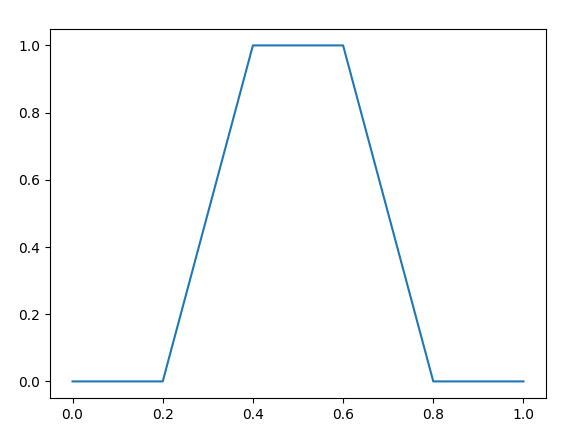
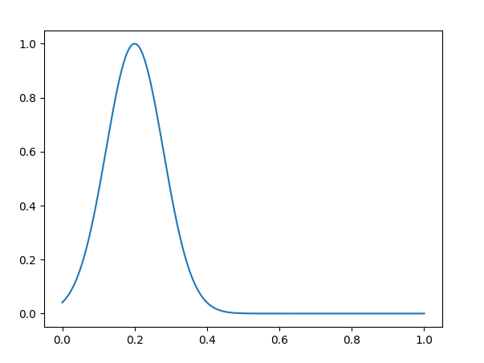

# Sistema de Inferencia Difusa

## Generales del Estudiante

- **Nombre**: Adrian Tubal Paez Ruiz
- **Grupo**: C-412

## Contenido

- [Sistema de Inferencia Difusa](#sistema-de-inferencia-difusa)
  - [Generales del Estudiante](#generales-del-estudiante)
  - [Contenido](#contenido)
  - [Caracterı́sticas del Sistema de Inferencia propuesto](#caracterı́sticas-del-sistema-de-inferencia-propuesto)
  - [Implementación](#implementación)
    - [Funciones de membresía](#funciones-de-membresía)
      - [Triangular](#triangular)
      - [Trapezoidal](#trapezoidal)
      - [Gausiana](#gausiana)
      - [Sigmoidal](#sigmoidal)
      - [Combinación](#combinación)
    - [Variables lingüísticas](#variables-lingüísticas)
    - [Valores lingüísticos](#valores-lingüísticos)
      - [Evaluación](#evaluación)
    - [Expresiones](#expresiones)
      - [Evaluación de expresión](#evaluación-de-expresión)
    - [Reglas de inferencia](#reglas-de-inferencia)
    - [SID](#sid)
  - [Ejemplo](#ejemplo)
    - [Definiendo las variables lingüísticas](#definiendo-las-variables-lingüísticas)
    - [Declarando las reglas](#declarando-las-reglas)
    - [Declarando el sistema de inferencia](#declarando-el-sistema-de-inferencia)
    - [Ejecucion con una entrada](#ejecucion-con-una-entrada)

## Caracterı́sticas del Sistema de Inferencia propuesto

El Sistema de Inferencia Difusa propuesto consta de las siguientes características:

- Funciones de membresía:
  - Triangular
  - Trapezoidal
  - Gausiana
  - Sigmoidal
- Declaración de Variables Linguisticas
- Declaración de reglas de inferencia
- Metodos de difusificación:
  - Mamdani
  - Larsen
- Metodos de desdifusificación:
  - Centroide
  - Bisección
  - Basados en máximos (primero, último y promedio)
  
## Implementación

### Funciones de membresía

Las funciones de membresía están implementadas en `sid.functions`, basándose en la clase base `Membership`. El único requerimiento que impone la declaración es el conocimiento previo del dominio de la función, que es considerado un intervalo `[x,y]`, que debe ser pasado como argumento `dom` en la declaración de cualquier función.

La clase base tiene implementada todas las funcionalidades principales como son:

- **Difusificación**, que no es mas que la evaluación de la función en un valor del dominio, mediante el método de instancia `__call__`.
- **Desdifusificación**, mediante el método de instancia `desdifusificate`.
- Permite la **representación** gráfica de la función mediante el método de instancia `plot` (hay que ejecutar `matplotlib.pyplot.show()` en el momento que se desee mostrar) .
- La **combinación** se realiza mediante el operador `+` entre dos clases herederas de `Membership`, dandon como resultado `MembershipCombined`

#### Triangular

Esta implementada en la clase `MembershipTriangular`. Para su definición son necesarios cuatro parámetros:

- dominio de definición
- vértice izquierdo
- vértice superior
- vértice derecho


#### Trapezoidal

Esta implementada en la clase `MembershipTrapezoidal`. Para su definición son necesarios cuatro parámetros:

- dominio de definición
- vértice inferior izquierdo
- vértice superior izquierdo
- vértice superior derecho
- vértice inferior derecho



#### Gausiana

Esta implementada en la clase `MembershipGausian`. Para su definición son necesarios cuatro parámetros:

- dominio de definición
- valor central
- factor que define cuan abierta o cerrada es la campana



#### Sigmoidal

Esta implementada en la clase `MembershipSigmoidal`. Para su definición son necesarios cuatro parámetros:

- dominio de definición
- inicio de la curvatura
- punto de inflección
- fin de la curvatura

Las disatancias desde el inicio y fin de la curvatura, hasta el punto de inflección deben ser iguales.


#### Combinación

Esta implementada en la clase `MembershipCombined`. La combinación de funciones esta dada por la siguiente definicion:

> Sea Z la combinación del conjunto de funciones {A,B,C...}, se cumple que:
>
> Z(x) = max(A(x), B(x), C(x),...)

Por ejemplo, si se combinan las funciones Sigmoidal y Gausiana explicadas anteriormente, se obtiene:


### Variables lingüísticas

Su implementación se encuentra en `sid.linguistic_variable`, mediante la clase `LinguisticVar`. Una variable lingüística consta de la siguiente estructura:

> L = (N,V)

Donde N es el nombre de la variable y V el conjunto de valores lingüísticos. Por ejemplo:

> L = (temperatura, {fria, caliente})

### Valores lingüísticos

Su implementación se encuentra en `sid.linguistic_variable`, mediante la clase `LinguisticValue`. Son los posibles valores que puede tener una variable lingüística, y están asociados directamente a una. Se definen segun la siguien estructura:

> v = (n,F)

Tal que **n** es el nombre y **F** es la función de membresía. Por ejemplo:

> v = (fria, Trapezoidal)

#### Evaluación

La evaluación de los valores lingüísticos, es equivalente a determinar el grado de pertenencia a la función de membresía asociada. En el Sistema de Inferencia Difusa se brinda una entrada, la cual es el único parametro en la evaluación de la variable. El proceso de evaluación consiste en extrarer de dicha entrada el valor escalar asociado a la variable lingüística y evaluar la función de pertenencia en dicho valor.

### Expresiones

Su implementación se encuentra en `sid.fuzzy_expression`. Una expresión en la lógica difusa es la composición de los operadores `and`, `or` y `not`; y los valores atómicos. La implementación se basa en las clase `Expression` y en sus herederos `ExpressionInvert`, `ExpressionAnd`, `ExpressionOr` y `ExpressionAtomic`. La declaración de expresiones se basa en la concatenación de `Expression` y los operadores `&`, `|` y `~`, por ejemplo:

- `Expression & Expression = ExpressionAnd`
- `Expression | Expression = ExpressionOr`
- `~ Expresion = ExpressionInvert`

#### Evaluación de expresión

La declaración de la expresión devuelve una composición de expresiones, que se puede evaluar invocándola, por ejemplo:

```python
E1 = Expression & Expression | Expression
E1()
```

La base de las expresiones son los valores lingüísticos (`LinguisticValue`), se representa por `ExpressionAtomic` que recive como parámetro el valor lingüístico asociado.

### Reglas de inferencia

Implementada en `sid.rule`. Tiene como propiedades la expresión (`Expression`) y su consecuencia (`LinguisticValue`) quedando de la forma:

```.
RX : IF [EXPRESSION] THEN linguistic_value
```

### SID

Un SID esta definidio por un conjunto de reglas (`Rule`), un conjunto de variables de salida, un método de difusificación y un conjunto de métodos de desdifusicación. Las variables de entrada son deducidas de las reglas.

Para la ejecucion del sistema, es necesario una netrada, que consta de el valor escalar que recibe cada variable de entrada, dando como resultado una grafica por cada variable de salida y cada método de desdifusicación.

## Ejemplo

Por ejemplo, sean las siguientes reglas en lenguaje natural:

- Si el servicio es pobre o la comida es mala, entonces la propina es poca.
- Si el servicio es bueno, entonces la propina es promedio.
- Si el servicio es excelente o la comida es deliciosa, entonces la propina es generosa

Dado el grupo de reglas, se pueden definir las siguientes variables lingüísticas con sus respectivos valores:

- `servicio = {pobre, bueno, excelente}`
- `comida = {mala, deliciosa}`
- `propina = {poca, promedio, generosa}`

### Definiendo las variables lingüísticas

Para poder definir dichas variables se deben definir sus funciones de pertenencia, de la siguiente forma:

```python
# Definiendo servicio
servicio_pobre = LinguisticValue(
    "servicio", "pobre", MembershipTrapezoidal((0, 10), 0, 0, 2, 4))
servicio_bueno = LinguisticValue(
    "servicio", "bueno", MembershipTrapezoidal((0, 10), 3, 5, 7, 8))
servicio_excelente = LinguisticValue(
    "servicio", "excelente", MembershipTrapezoidal((0, 10), 7, 8, 10, 10))
servicio = LinguisticVar(
    "servicio", [servicio_pobre, servicio_bueno, servicio_excelente])
servicio.plot()
```


```python
# Definiendo comida

comida_mala = LinguisticValue(
    "comida", "mala", MembershipTrapezoidal((0, 10), 0, 0, 3, 5))
comida_deliciosa = LinguisticValue(
    "comida", "deliciosa", MembershipTrapezoidal(
        (0, 10), 7, 8, 10, 10)
)
comida = LinguisticVar(
    "comida", [comida_mala, comida_deliciosa]
)
comida.plot()
```


```python
# Definicion propina
propina_poca = LinguisticValue(
    "propina", "poca", MembershipTrapezoidal((0, 10), 0, 0, 3, 4)
)

propina_promedio = LinguisticValue(
    "propina", "promedio", MembershipTrapezoidal((0, 10), 3, 4, 7, 8)
)

propina_generosa = LinguisticValue(
    "propina", "generosa",  MembershipTrapezoidal(
        (0, 10), 7, 8, 10, 10)
)

propina = LinguisticVar(
    "propina", [propina_poca, propina_promedio, propina_generosa])

propina.plot()
```


### Declarando las reglas

Una vez que esten definidas todas las variables lingüísticas se pueden declarar las reglas de la siguiente manera:

```python
# Si el servicio es pobre o la comida es mala, entonces la propina es poca.
R1 = Rule(
    ExpressionAtomic(servicio_pobre) | ExpressionAtomic(comida_mala),
    propina_poca
)

# Si el servicio es bueno, entonces la propina es promedio.
R2 = Rule(
    ExpressionAtomic(servicio_bueno),
    propina_promedio
)

# Si el servicio es excelente o la comida es deliciosa, entonces la propina es generosa
R3 = Rule(
    ExpressionAtomic(servicio_excelente) | ExpressionAtomic(
        comida_deliciosa),
    propina_generosa
)
```

### Declarando el sistema de inferencia

```python
s = SID([R1, R2, R3], [propina], AM_LARSEN,
        set([DM_CENTROID, DM_BISECCION, DM_FIRSTMAX, DM_LASTMAX, DM_AVEMAX]))
```

El sistema tiene como método de difusificación, el método de Larsen; y para la desdifusificación a todos los implementados.

### Ejecucion con una entrada

Sea `inp` una entrada válida para el sistema previamente declarado:

```python
inp = {
    "servicio": 4,
    "comida": 7.5
}
# s es el sistema declarado en la seccion anterior
s(inp)
s.plot()
```


Tomando una entrada diferente:

```python
s.reset()
inp = {
    "servicio": 6,
    "comida": 7.5
}
# s es el sistema declarado en la seccion anterior
s(inp)
s.plot()
```


